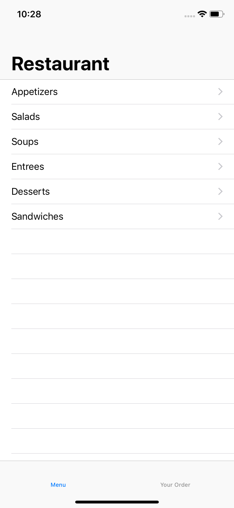
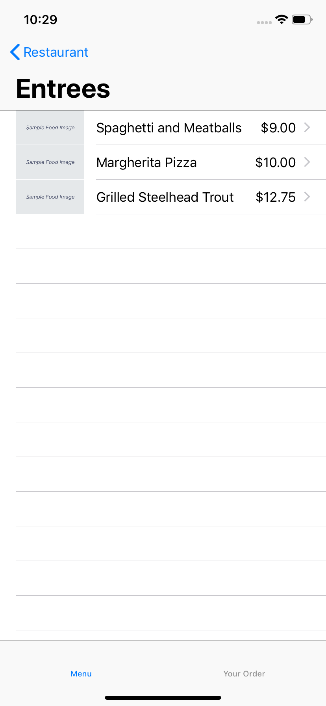
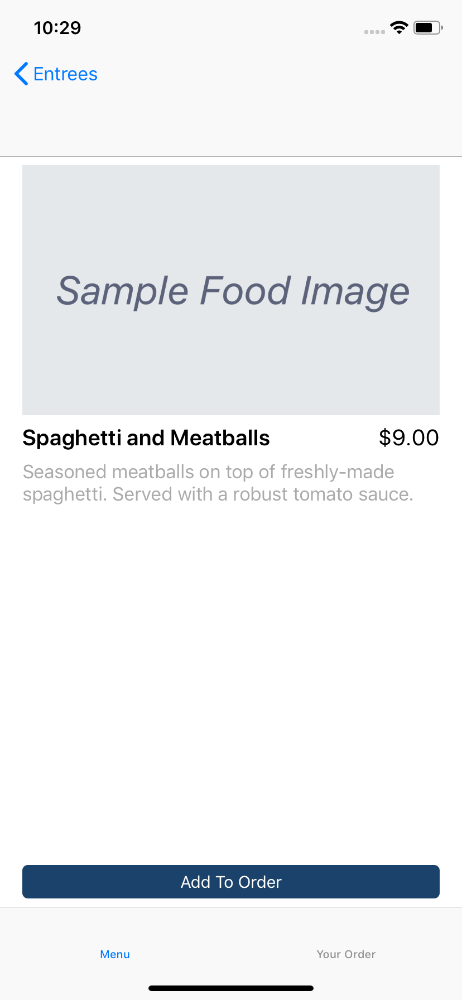

Restaurant Menu 

About: Restaurant Menu App to Place Online Orders.

 

 

Description: Interactive menu for a restaurant that allows the customer to view a list of offerings, 
add items to an order, and submit the order to the restaurant.

Technologies Used: Interface Builder, Foundation & UIKIt, JSON, TableView, Swift, Xcode

 
